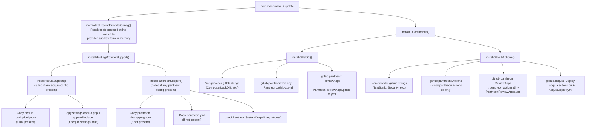

# Plan: Standardize Hosting Provider Configuration

## Original Work Order

> I need you to create a comprehensive, detailed implementation plan (as a markdown document) for standardizing hosting provider configuration in the Drainpipe project. This is a Composer plugin for Drupal projects that scaffolds CI/CD files for Acquia and Pantheon hosting. Do NOT write any code — this is a planning document only.
>
> Design a standardized `drainpipe.acquia` and `drainpipe.pantheon` configuration structure in `composer.json` that: mirrors each other in structure as closely as possible; covers settings file scaffolding, Taskfile include, package recommendation, CI-specific workflows, hosting-config files; does NOT break any existing configurations; resolves issues #499 and #510; fixes the `"github": ["Pantheon"]` silent no-op; and cleans up the code structure.

**User clarifications provided during planning:**

| Question area | Clarification |
|---|---|
| Top-level CI key structure | Keep `extra.drainpipe.github` and `extra.drainpipe.gitlab` as the top-level CI keys. Provider configuration is a sub-key within those CI keys, not a separate top-level provider key. |
| `settings.pantheon.php` | Do not create a Pantheon settings scaffold file. The existing `pantheon-systems/drupal-integrations` package recommendation warning is the correct behavior. |
| Taskfile automation | Do not automate injection of includes into `Taskfile.yml`. Manual addition by the user remains the expected workflow. |

---

## Executive Summary

Drainpipe's hosting provider support for Acquia and Pantheon has grown organically and now exhibits structural inconsistencies: naming conventions differ between providers (`acquia` lowercase vs `Pantheon` PascalCase), CI-agnostic file scaffolding (such as `pantheon.yml` and `.drainpipeignore`) is buried inside GitLab-specific code paths meaning GitHub-only Pantheon users never receive them, a `"github": ["Pantheon"]` entry is a silent no-op (issues #499 and #510), and there is no way to obtain Pantheon GitHub Actions without also accepting the full `PantheonReviewApps` workflow.

This plan standardizes provider configuration as named sub-keys within the existing `extra.drainpipe.github` and `extra.drainpipe.gitlab` objects. Both CI keys evolve from flat string arrays into objects that can carry either plain string values (for non-provider features like `TestStatic`) or provider-keyed sub-arrays (for `acquia` and `pantheon`). Every existing string-array configuration is preserved as a deprecated alias. A new `installPantheonSupport()` and a refactored `installAcquiaSupport()` centralize all CI-agnostic provider scaffolding so that file placement no longer depends on which CI system a team uses.

The result is a configuration surface where both providers are expressed symmetrically inside the CI key they target, all current configurations continue working without modification, and the structural problems identified in issues #499 and #510 are eliminated through explicit, well-understood code paths.

---

## Context

### Current State vs Target State

| Aspect | Current State | Target State | Why |
|---|---|---|---|
| Provider CI config location | Acquia: `"github": ["acquia"]`; Pantheon: `"github": ["PantheonReviewApps"]` and `"gitlab": ["Pantheon", "PantheonReviewApps"]` — flat string values inside CI arrays | Provider entries become named sub-keys within the CI object: `"github": {"acquia": ["Deploy"]}`, `"github": {"pantheon": ["Actions", "ReviewApps"]}`, `"gitlab": {"pantheon": ["Deploy", "ReviewApps"]}` | Enables symmetric structure, eliminates PascalCase collision risk, and allows per-provider option arrays |
| Naming convention | `"acquia"` lowercase; `"Pantheon"` / `"PantheonReviewApps"` PascalCase — inconsistent within the same array | `acquia` lowercase provider key; `pantheon` lowercase provider key; option values use PascalCase: `"Deploy"`, `"Actions"`, `"ReviewApps"` | Internal consistency within the sub-array per provider |
| Pantheon CI-agnostic file scaffolding | `pantheon.yml` and `.drainpipeignore` only copied inside `installGitlabCI()` when `"gitlab": ["Pantheon"]` is present | Copied by a new `installPantheonSupport()` called whenever any Pantheon CI option is configured, regardless of CI system | GitHub-only Pantheon users currently never receive `pantheon.yml` or `.drainpipeignore` |
| `"github": ["Pantheon"]` | Silent no-op — no code handles this value (issue #510) | Treated as deprecated alias for `"github": {"pantheon": ["Actions"]}` — emits deprecation warning and scaffolds Pantheon actions directory | Issue #499/#510 |
| Pantheon GitHub Actions only | No way to get the Pantheon actions directory without also accepting `PantheonReviewApps.yml` workflow | `"github": {"pantheon": ["Actions"]}` scaffolds actions directory only; `["ReviewApps"]` scaffolds actions + workflow | Issue #499 — teams with their own deployment workflow need the composite actions without the managed workflow |
| Acquia naming in GitHub | `"github": ["acquia"]` lowercase string | `"github": {"acquia": ["Deploy"]}` — deprecated alias accepted | Consistency; maps cleanly to the new provider sub-key pattern |
| `settings.pantheon.php` | Does not exist; Pantheon settings handled by `pantheon-systems/drupal-integrations` with a warning | No change — warning behavior retained; no new scaffold file | Package already handles this correctly |
| Taskfile includes | Manual addition required by users | No change — manual addition remains the expected workflow | Intentional; automation not requested |
| Code structure | Hosting provider CI-agnostic logic scattered across `installHostingProviderSupport()`, `installGitlabCI()`, and `installGitHubActions()` with a `@TODO` comment and dead code | CI-agnostic scaffolding centralized in `installAcquiaSupport()` and `installPantheonSupport()`; CI methods handle only CI file copying | Separation of concerns; eliminates `@TODO` block and duplicated logic |
| GitLab Acquia support | Not present | Remains out of scope | Confirmed by project team |

### Background

Drainpipe uses `composer.json`'s `extra.drainpipe` block to drive all scaffolding decisions. The plugin runs on `POST_INSTALL_CMD` and `POST_UPDATE_CMD` and copies files from `vendor/lullabot/drainpipe/scaffold/` into the consumer project.

The Pantheon scaffolding problem is well-understood: `installGitlabCI()` was the original home for all Pantheon work, and when GitHub Actions support was added later, no equivalent CI-agnostic file path was wired up. The `if ($gitlab === 'Pantheon')` block copies `pantheon.yml` and `.drainpipeignore` as a side-effect, but the GitHub Actions path has no equivalent. A project that only uses GitHub never receives these files unless `installPantheonSupport()` is extracted and called unconditionally.

The flat string array schema for `github` and `gitlab` was appropriate for the initial design but cannot express per-provider option arrays. Evolving these keys from flat arrays to objects — where string values remain valid for non-provider features and provider names become sub-array keys — extends the schema without breaking any existing string values.

---

## Architectural Approach



### Component 1: New composer.json Configuration Schema

**Objective**: Define an extended schema for `extra.drainpipe.github` and `extra.drainpipe.gitlab` that accommodates provider sub-keys while remaining backward compatible with existing string values.

Both `github` and `gitlab` evolve from flat string arrays into objects. Non-provider feature values (`TestStatic`, `Security`, `ComposerLockDiff`, `LockfileDiff`, `TestFunctional`) move to a top-level array under the object (or remain as plain strings in a mixed representation), while provider names become reserved sub-keys with their own option arrays.

The cleanest representation that requires the fewest code changes is an object where non-provider values move to a plain string array under a neutral key (or are detected by type at parse time). However, the simplest approach given the existing codebase iteration patterns is to represent the schema as an **object** where:

- Plain string values in the current array migrate to an explicit feature array or remain detectable by `is_string()` type checking in the loop
- Provider keys (`acquia`, `pantheon`) are reserved names that hold arrays of option strings

**Proposed schema:**

```
extra.drainpipe.github:
  Can be an array (legacy/deprecated) OR an object:
  {
    "acquia": array of strings — ["Deploy"]
    "pantheon": array of strings — ["Actions", "ReviewApps"]
    // All non-provider string values (TestStatic, Security, etc.)
    // are expressed as a plain array under a "features" key OR
    // kept at the top level as loose string entries detected by is_string()
  }

extra.drainpipe.gitlab:
  Can be an array (legacy/deprecated) OR an object:
  {
    "pantheon": array of strings — ["Deploy", "ReviewApps"]
    // Non-provider string values (ComposerLockDiff) at top level
  }
```

Because introducing a `features` wrapper key would be a breaking change for the non-provider string values, the preferred implementation is **mixed-type parsing**: the plugin iterates the object's entries and handles each entry either as a provider sub-array (when the key is `acquia` or `pantheon`) or as a plain feature string (when the value is a string). PHP's `foreach` over an associative array handles both cases naturally.

**Full allowed values:**

```
github.acquia:   ["Deploy"]
github.pantheon: ["Actions", "ReviewApps"]
gitlab.pantheon: ["Deploy", "ReviewApps"]
```

`"Deploy"` for `acquia` and `"Deploy"` for `gitlab.pantheon` use the same term to mean "scaffold the CI files that enable deployment to this provider." `"Actions"` for `github.pantheon` means "scaffold the composite actions directory only, without any workflow file." `"ReviewApps"` in both contexts means "scaffold the review app deployment pipeline," and for GitHub it implicitly includes the `Actions` behavior.

**Side-by-side schema comparison:**

| Capability | Acquia expression | Pantheon expression |
|---|---|---|
| Acquia/Pantheon settings file | `drainpipe.acquia.settings: true` (top-level, unchanged) | No settings scaffold — existing behavior retained |
| GitHub: actions + workflow | `github: {"acquia": ["Deploy"]}` | `github: {"pantheon": ["ReviewApps"]}` |
| GitHub: actions only | N/A — Deploy always includes the workflow | `github: {"pantheon": ["Actions"]}` |
| GitLab: deploy helpers | Out of scope | `gitlab: {"pantheon": ["Deploy"]}` |
| GitLab: review app pipeline | Out of scope | `gitlab: {"pantheon": ["ReviewApps"]}` |
| CI-agnostic config files | `.drainpipeignore` — triggered by any Acquia config | `pantheon.yml` + `.drainpipeignore` — triggered by any Pantheon CI config |

**Complete `composer.json` examples:**

GitHub-hosted Pantheon project with full review app support:
```json
"extra": {
  "drainpipe": {
    "github": {
      "pantheon": ["ReviewApps"],
      "Security": true,
      "TestStatic": true
    }
  }
}
```

GitHub-hosted Pantheon project that manages its own workflow but uses Drainpipe composite actions:
```json
"extra": {
  "drainpipe": {
    "github": {
      "pantheon": ["Actions"]
    }
  }
}
```

GitLab-hosted Pantheon project:
```json
"extra": {
  "drainpipe": {
    "gitlab": {
      "pantheon": ["Deploy", "ReviewApps"]
    }
  }
}
```

Acquia project with GitHub Actions:
```json
"extra": {
  "drainpipe": {
    "acquia": { "settings": true },
    "github": {
      "acquia": ["Deploy"]
    }
  }
}
```

> Note: Non-provider GitHub/GitLab feature values (`TestStatic`, `Security`, `ComposerLockDiff`, `LockfileDiff`, `TestFunctional`) are discussed further in Component 8, where the parsing strategy handles both the legacy array form and the new object form.

---

### Component 2: Backwards Compatibility Strategy

**Objective**: Every existing documented configuration continues to produce identical scaffolding output. Deprecated values emit a warning on `composer update` but cause no behavioral change.

Normalization runs in `normalizeHostingProviderConfig()` before any scaffolding logic. It reads `$this->extra['drainpipe']['github']` and `$this->extra['drainpipe']['gitlab']`, detects deprecated provider string values, emits warnings via `$this->io->warning()`, and rewrites the affected arrays into the new object form in memory. The user's `composer.json` is never modified.

**Complete deprecated key mapping:**

| Old value (array entry) | New equivalent (object sub-key) | Warning text |
|---|---|---|
| `"github": ["acquia"]` | `"github": {"acquia": ["Deploy"]}` | "The 'github: [\"acquia\"]' value is deprecated. Use 'github: {\"acquia\": [\"Deploy\"]}' instead." |
| `"github": ["PantheonReviewApps"]` | `"github": {"pantheon": ["ReviewApps"]}` | "The 'github: [\"PantheonReviewApps\"]' value is deprecated. Use 'github: {\"pantheon\": [\"ReviewApps\"]}' instead." |
| `"github": ["Pantheon"]` | `"github": {"pantheon": ["Actions"]}` | "The 'github: [\"Pantheon\"]' value is deprecated and was previously a no-op. It now scaffolds Pantheon GitHub Actions. Use 'github: {\"pantheon\": [\"Actions\"]}' instead." |
| `"gitlab": ["Pantheon"]` | `"gitlab": {"pantheon": ["Deploy"]}` | "The 'gitlab: [\"Pantheon\"]' value is deprecated. Use 'gitlab: {\"pantheon\": [\"Deploy\"]}' instead." |
| `"gitlab": ["PantheonReviewApps"]` | `"gitlab": {"pantheon": ["ReviewApps"]}` | "The 'gitlab: [\"PantheonReviewApps\"]' value is deprecated. Use 'gitlab: {\"pantheon\": [\"ReviewApps\"]}' instead." |

Non-provider string values in `github` and `gitlab` arrays (`TestStatic`, `Security`, `ComposerLockDiff`, `LockfileDiff`, `TestFunctional`) are not deprecated and require no normalization. They continue to be processed by the existing loop logic unchanged.

The `extra.drainpipe.acquia` object with a `settings` sub-key is already the correct form and requires no normalization.

Deprecation warnings are emitted on both `POST_INSTALL_CMD` and `POST_UPDATE_CMD`. The warning text is consistent with Drainpipe's existing `$this->io->warning()` style.

---

### Component 3: Settings File Scaffolding

**Objective**: Define the complete behavior for settings file scaffolding, confirming what changes and what stays the same.

**Acquia — unchanged:**

The existing `scaffold/acquia/settings.acquia.php` behavior is unchanged:
- Triggered by `extra.drainpipe.acquia.settings: true`
- Copies `settings.acquia.php` to `web/sites/default/settings.acquia.php` if not present
- Appends `include __DIR__ . "/settings.acquia.php";` to `web/sites/default/settings.php` if not already present
- Copies `scaffold/acquia/.drainpipeignore` to `.drainpipeignore` if not present (this is part of `installAcquiaSupport()`, not conditional on `settings: true`)

**Pantheon — no new settings file:**

No `settings.pantheon.php` scaffold file is created. The existing behavior is retained:
- `pantheon-systems/drupal-integrations` is the recommended package for Pantheon Drupal settings
- `checkPantheonSystemDrupalIntegrations()` is called from `installPantheonSupport()` whenever any Pantheon CI configuration is present
- The `hasPantheonConfigurationFiles()` fallback in event handlers is retained for projects that have `pantheon.yml` or `pantheon.upstream.yml` on disk but no `drainpipe.pantheon` CI config

---

### Component 4: Hosting Config File Scaffolding (CI-agnostic)

**Objective**: Decouple CI-agnostic provider file scaffolding from CI-specific configuration, so that files required for any Pantheon deployment are placed regardless of which CI system the project uses.

**New `installPantheonSupport()`:**

This method is called by `installHostingProviderSupport()` whenever any `pantheon` key appears under `github` or `gitlab` in the drainpipe config (i.e., whenever the resolved config has any Pantheon CI entries). It performs only CI-agnostic operations:

1. Copy `scaffold/pantheon/pantheon.yml` to `./pantheon.yml` if not already present.
2. Copy `scaffold/pantheon/.drainpipeignore` to `./.drainpipeignore` if not already present. If `.drainpipeignore` exists, check for the `/web/sites/default/files` sentinel and warn if missing (existing behavior preserved).
3. Call `checkPantheonSystemDrupalIntegrations($composer)`.

The `installGitlabCI()` code block that currently handles `$gitlab === 'Pantheon'` (copying `.drainpipeignore`, `pantheon.yml`, and calling `checkPantheonSystemDrupalIntegrations`) is removed once `installPantheonSupport()` is in place.

**Detection of "any Pantheon CI config":**

After normalization, `installPantheonSupport()` is triggered when:
- `$this->extra['drainpipe']['github']['pantheon']` is non-empty, OR
- `$this->extra['drainpipe']['gitlab']['pantheon']` is non-empty

A helper method `hasAnyPantheonCIConfig()` encapsulates this check.

**Refactored `installAcquiaSupport()`:**

The existing Acquia logic in `installHostingProviderSupport()` is extracted into its own method without functional change:

1. Copy `scaffold/acquia/.drainpipeignore` to `./.drainpipeignore` if not present.
2. If `settings: true`, copy `settings.acquia.php` and append the include to `settings.php`.

`installAcquiaSupport()` is called whenever `$this->extra['drainpipe']['acquia']` is non-empty.

**Why `.drainpipeignore` remains provider-specific:**

The Acquia `.drainpipeignore` excludes `/docroot/sites/default/files`. The Pantheon version excludes `/web/sites/default/files`. These reflect the different web root conventions between the two platforms. A project deploys to one provider, so having one `.drainpipeignore` is correct; each provider method uses its own scaffold file.

---

### Component 5: GitHub Actions Changes

**Objective**: Fix the `"github": ["Pantheon"]` silent no-op, introduce a standalone `Actions` option for Pantheon, and map deprecated string values to their new provider sub-key equivalents.

**Pantheon — new behavior via `github.pantheon`:**

`"github": {"pantheon": ["Actions"]}` — copies `scaffold/github/actions/pantheon/` to `.github/actions/drainpipe/pantheon/`. No workflow file is installed. This resolves issue #499: teams that manage their own deployment workflow YAML can obtain the composite actions (setup-terminus, push, clone-env, update, review) without being forced to accept the managed `PantheonReviewApps.yml` workflow.

`"github": {"pantheon": ["ReviewApps"]}` — copies `scaffold/github/actions/pantheon/` (same as `Actions`) and installs `PantheonReviewApps.yml` (or `PantheonReviewAppsDDEV.yml` when DDEV is detected) to `.github/workflows/PantheonReviewApps.yml`. `ReviewApps` implies `Actions`: when `ReviewApps` is present, the actions directory is always copied regardless of whether `Actions` is also listed.

When both `"Actions"` and `"ReviewApps"` are listed, the actions directory is copied exactly once.

`checkPantheonSystemDrupalIntegrations()` is called from `installPantheonSupport()` and is not repeated in the GitHub Actions handling.

**Acquia — new behavior via `github.acquia`:**

`"github": {"acquia": ["Deploy"]}` — copies `scaffold/github/actions/acquia/` to `.github/actions/drainpipe/acquia/` and installs `AcquiaDeploy.yml` to `.github/workflows/AcquiaDeploy.yml`. This is behaviorally identical to the current `"github": ["acquia"]` string; the change is only in how the configuration is expressed.

No additional Acquia GitHub workflow variants (e.g. a review apps workflow) are in scope.

**Common GitHub Actions infrastructure:**

The common actions directory (`scaffold/github/actions/common/`) continues to be copied unconditionally whenever any `github` CI key is present. The normalization step ensures that after deprecated string values are converted to provider sub-keys, the `github` value is no longer a plain array; the existing common-actions copy logic must therefore be adjusted to trigger on the presence of the `github` key rather than the array being non-empty — these are equivalent checks.

---

### Component 6: GitLab CI Changes

**Objective**: Move Pantheon GitLab CI entries into the provider sub-key form, remove CI-agnostic file scaffolding from `installGitlabCI()`, and confirm Acquia GitLab support is out of scope.

**Pantheon — new behavior via `gitlab.pantheon`:**

`"gitlab": {"pantheon": ["Deploy"]}` — copies `scaffold/gitlab/Pantheon.gitlab-ci.yml` to `.drainpipe/gitlab/Pantheon.gitlab-ci.yml`. Provides the `.drainpipe_pantheon_setup_terminus` helper script reference for use in project CI pipelines.

`"gitlab": {"pantheon": ["ReviewApps"]}` — copies `scaffold/gitlab/PantheonReviewApps.gitlab-ci.yml` to `.drainpipe/gitlab/PantheonReviewApps.gitlab-ci.yml`. Installs the full Multidev review app pipeline including deployment, stop, and scheduled cleanup jobs.

The `if ($gitlab === 'Pantheon')` special-case block in `installGitlabCI()` — which currently copies `.drainpipeignore`, `pantheon.yml`, and calls `checkPantheonSystemDrupalIntegrations()` — is removed entirely. These responsibilities move to `installPantheonSupport()`.

**Iteration over `gitlab` entries:**

After normalization, `installGitlabCI()` iterates the resolved `gitlab` config. Non-provider entries (e.g. `ComposerLockDiff`) are processed as today by looking up `$scaffoldPath/gitlab/$value.gitlab-ci.yml`. Provider entries are processed by a new inner block that handles `pantheon` sub-array values explicitly. This avoids the existing dynamic file lookup path attempting to open `$scaffoldPath/gitlab/pantheon.gitlab-ci.yml` (which does not exist).

**Acquia GitLab CI:**

No GitLab CI support for Acquia is planned. This is confirmed out of scope.

---

### Component 7: Code Refactoring Plan for ScaffoldInstallerPlugin.php

**Objective**: Reorganize the plugin's method structure to reflect the new schema, eliminate dead code, and centralize CI-agnostic provider scaffolding.

**New `normalizeHostingProviderConfig()`:**

A private method called at the start of `installHostingProviderSupport()`. Performs the following:

1. Inspect `$this->extra['drainpipe']['github']` for deprecated hosting-provider string values (`"acquia"`, `"Pantheon"`, `"PantheonReviewApps"`).
2. For each deprecated value found: emit `$this->io->warning()`, remove the string from the array, and add the corresponding entry to the provider sub-key (`github.acquia`, `github.pantheon`).
3. Repeat for `$this->extra['drainpipe']['gitlab']` with deprecated values `"Pantheon"` and `"PantheonReviewApps"`.
4. Write the normalized values back to `$this->extra['drainpipe']['github']` and `$this->extra['drainpipe']['gitlab']`.

The normalization produces an in-memory representation where `github` and `gitlab` are objects with string feature values and provider sub-arrays. All subsequent logic reads only from this normalized form.

**Updated `installHostingProviderSupport()`:**

```
installHostingProviderSupport():
  normalizeHostingProviderConfig()
  if acquia config present: installAcquiaSupport()
  if any pantheon CI config present: installPantheonSupport($composer)
```

The `$composer` instance is threaded through to `installPantheonSupport()` so it can call `checkPantheonSystemDrupalIntegrations($composer)`. The existing method already receives `Composer $composer` via `installCICommands()`; `installHostingProviderSupport()` must be updated to accept and pass this parameter. Alternatively, `installPantheonSupport()` can receive `$scaffoldPath` and `$composer` matching the existing `installGitlabCI()` and `installGitHubActions()` signatures.

**New `installAcquiaSupport()`:**

Contains the logic currently in the Acquia block of `installHostingProviderSupport()`. No functional change.

**New `installPantheonSupport(string $scaffoldPath, Composer $composer)`:**

Contains the CI-agnostic Pantheon scaffolding extracted from `installGitlabCI()`. Copies `pantheon.yml` and `.drainpipeignore`. Calls `checkPantheonSystemDrupalIntegrations($composer)`.

**Updated `installGitlabCI()`:**

- The `if ($gitlab === 'Pantheon')` special-case block (`.drainpipeignore`, `pantheon.yml`, `checkPantheonSystemDrupalIntegrations`) is removed.
- The loop over `$this->extra['drainpipe']['gitlab']` is updated to handle the normalized object form: iterate over entries, skip the `pantheon` key in the generic file-copy loop, and handle `pantheon` in a dedicated block that processes `["Deploy", "ReviewApps"]` values.
- The existing generic file-copy path (`$scaffoldPath/gitlab/$value.gitlab-ci.yml`) continues to handle non-provider string values as before.

**Updated `installGitHubActions()`:**

- The `if ($github === 'PantheonReviewApps')` block is replaced by logic reading from the normalized `$this->extra['drainpipe']['github']['pantheon']` array.
- The `if ($github === 'acquia')` block is replaced by logic reading from `$this->extra['drainpipe']['github']['acquia']`.
- The dead-code `if (isset($this->extra['drainpipe']['acquia'])) { // TODO: Add Acquia related GitHub Actions. }` block is removed.
- The common-actions copy continues to run whenever the `github` key is present and non-empty.
- Non-provider string values (`TestStatic`, `Security`, etc.) continue to be handled by the existing `else if` chain, now guarded by a type check (`is_string($github)`) to distinguish them from provider sub-arrays during iteration.

**Event handler cleanup (`onPostInstallCmd` / `onPostUpdateCmd`):**

The explicit `if ($this->hasPantheonConfigurationFiles())` check in the event handlers calls `checkPantheonSystemDrupalIntegrations()` or `pantheonSystemDrupalIntegrationsWarning()` separately from the main scaffolding flow. This fallback handles projects that have `pantheon.yml` or `pantheon.upstream.yml` on disk but no `drainpipe.pantheon` CI config. This fallback is **retained** because it correctly handles Pantheon sites that use Drainpipe without any CI configuration. The new `installPantheonSupport()` call additionally triggers for projects with explicit Pantheon CI config, meaning the check will be called once by `installPantheonSupport()` and may also be called by the fallback — `checkPantheonSystemDrupalIntegrations()` is idempotent (it only warns once) so this is not a problem.

---

### Component 8: README Documentation Plan

**Objective**: Update the README to document the new schema and provide clear migration guidance.

**"Hosting Provider Integration — Pantheon" section:**

- Replace the current `"github": ["PantheonReviewApps"]` example with the new `"github": {"pantheon": ["ReviewApps"]}` form.
- Add documentation for `"github": {"pantheon": ["Actions"]}` as the new standalone option for teams that only want the composite actions.
- Replace `"gitlab": ["Pantheon", "PantheonReviewApps"]` example with `"gitlab": {"pantheon": ["Deploy", "ReviewApps"]}`.
- Add a "Deprecated configuration" callout box listing old string values and their new equivalents.

**"Hosting Provider Integration — Acquia" section:**

- Replace `"github": ["acquia"]` example with `"github": {"acquia": ["Deploy"]}`.
- Add a "Deprecated configuration" callout box for the old `"acquia"` string value.

**"GitHub Actions Integration" section:**

- The `"Pantheon"` subsection: replace `"github": ["PantheonReviewApps"]` with new schema.
- The `"Acquia"` subsection: replace `"github": ["acquia"]` with new schema.

**"GitLab CI Integration" section:**

- The `"Pantheon"` subsection: replace `"gitlab": ["Pantheon", "PantheonReviewApps"]` with new schema.

**New subsection: "Migrating to the provider sub-key schema":**

Add this as a subsection of "Hosting Provider Integration" with the content from Component 9 below.

---

### Component 9: Migration Guide for Existing Users

**Objective**: Provide a self-contained reference showing old configurations alongside their new equivalents with notes on backward compatibility.

---

**Migration Guide**

All existing configurations continue to work without modification. Deprecated values emit a warning during `composer update` and `composer install` to prompt migration. No `composer.json` changes are mandatory.

**Acquia settings scaffolding:**

```json
// UNCHANGED — no migration needed
"extra": {
  "drainpipe": {
    "acquia": { "settings": true }
  }
}
```

**Acquia GitHub Actions:**

```json
// OLD (deprecated — emits warning)
"github": ["acquia"]

// NEW
"github": { "acquia": ["Deploy"] }
```

**Pantheon GitLab CI:**

```json
// OLD (deprecated — emits warning)
"gitlab": ["Pantheon", "PantheonReviewApps"]

// NEW
"gitlab": { "pantheon": ["Deploy", "ReviewApps"] }
```

**Pantheon GitHub Review Apps:**

```json
// OLD (deprecated — emits warning)
"github": ["PantheonReviewApps"]

// NEW
"github": { "pantheon": ["ReviewApps"] }
```

**New: Pantheon GitHub Actions only (no workflow):**

```json
// NEW — resolves issue #499; no previous equivalent
"github": { "pantheon": ["Actions"] }
```

This scaffolds the Pantheon composite actions directory (setup-terminus, push, clone-env, update, review) without installing the managed `PantheonReviewApps.yml` workflow. Use this when you maintain your own deployment workflow and want to use Drainpipe's actions as building blocks.

**Combining provider and non-provider GitHub entries:**

```json
// OLD — mixed array
"github": ["TestStatic", "Security", "PantheonReviewApps"]

// NEW — object with string feature values alongside provider sub-key
"github": {
  "TestStatic": true,
  "Security": true,
  "pantheon": ["ReviewApps"]
}
```

Non-provider features (`TestStatic`, `Security`, `ComposerLockDiff`, `LockfileDiff`, `TestFunctional`) can be expressed either as boolean-valued keys or retained as plain string entries in an array under the `github`/`gitlab` key. The implementation handles both forms.

**What changes automatically on upgrade (no `composer.json` edit required):**

When a project has `"gitlab": ["Pantheon"]` and runs `composer update` after Drainpipe is upgraded:

1. The deprecated value is normalized in memory to `gitlab.pantheon: ["Deploy"]`.
2. `installPantheonSupport()` now runs and scaffolds `pantheon.yml` and `.drainpipeignore` if not present — a net improvement for any GitHub-only Pantheon configuration that previously relied on the GitLab path to get these files.
3. GitLab CI files continue to be scaffolded as before.
4. A deprecation warning is printed recommending migration to the new schema.
5. No existing files are deleted or overwritten.

---

## Risk Considerations and Mitigation Strategies

<details>
<summary>Technical Risks</summary>

- **Mixed-type parsing of `github`/`gitlab` keys**: The existing code assumes these keys are flat string arrays. After normalization they become objects. Code that iterates the array via `foreach` expecting string values will encounter associative sub-arrays for provider keys.
    - **Mitigation**: After normalization, the iteration in `installGitlabCI()` and `installGitHubActions()` must check each entry's type: `is_string($value)` for feature strings, `is_array($value)` for provider sub-arrays. This is a localized change. The normalization step ensures that by the time iteration occurs, the in-memory structure is always in the normalized object form.

- **Idempotency of `installPantheonSupport()` alongside the `hasPantheonConfigurationFiles()` fallback**: Both paths can call `checkPantheonSystemDrupalIntegrations()`. If both fire in the same run, the warning is printed twice.
    - **Mitigation**: Introduce a private `$pantheonIntegrationsChecked` boolean flag that is set to `true` after the first call to `checkPantheonSystemDrupalIntegrations()`, preventing duplicate warnings.

</details>

<details>
<summary>Implementation Risks</summary>

- **Incremental implementation leaving inconsistent state**: If `installPantheonSupport()` is extracted but the `installGitlabCI()` special case is not yet removed, `pantheon.yml` and `.drainpipeignore` are copied twice on GitLab Pantheon projects.
    - **Mitigation**: The extraction of `installPantheonSupport()` and the removal of the `if ($gitlab === 'Pantheon')` CI-agnostic block must be a single atomic change in the same commit. Define the implementation sequence strictly: (1) extract methods with identical behavior, (2) remove duplicated logic, (3) add new sub-key support, (4) add normalization.

- **Unknown sub-key values in provider arrays**: If a user specifies `"github": {"pantheon": ["Deploy"]}` (an invalid value for Pantheon — `Deploy` is an Acquia option), the code must not silently ignore it.
    - **Mitigation**: Validate allowed values per provider per CI system and emit `$this->io->warning()` for unrecognized values, consistent with the existing pattern for unknown GitLab CI file names.

</details>

<details>
<summary>Integration Risks</summary>

- **`hasPantheonConfigurationFiles()` edge case for `pantheon.upstream.yml`**: Projects using a Pantheon upstream distribution have `pantheon.upstream.yml` but may have no `drainpipe.pantheon` CI config. The existing fallback must be retained.
    - **Mitigation**: `hasPantheonConfigurationFiles()` and its event-handler call are preserved unchanged. The new `installPantheonSupport()` is additive — it triggers for explicit CI config; the fallback triggers for implicit platform detection.

- **Non-provider `gitlab`/`github` string values breaking after object migration**: If a user's `composer.json` mixes old-style string arrays with new object syntax due to partial migration, the JSON is valid but the plugin must handle both representations gracefully in the same run.
    - **Mitigation**: The normalization step converts any remaining deprecated string values to provider sub-keys first. After normalization the structure is always in object form. The iteration logic then handles it uniformly.

</details>

---

## Success Criteria

### Primary Success Criteria

1. A project with `"gitlab": ["Pantheon", "PantheonReviewApps"]` runs `composer install` after the upgrade and all previously scaffolded files continue to be produced — specifically `.drainpipe/gitlab/Pantheon.gitlab-ci.yml`, `.drainpipe/gitlab/PantheonReviewApps.gitlab-ci.yml`, `pantheon.yml`, and `.drainpipeignore`.
2. A project with `"github": ["PantheonReviewApps"]` runs `composer install` after the upgrade and `.github/actions/drainpipe/pantheon/`, `.github/workflows/PantheonReviewApps.yml`, `pantheon.yml`, and `.drainpipeignore` are all present in the working tree — without requiring any `composer.json` change.
3. A new project configured with `"github": {"pantheon": ["Actions"]}` receives `.github/actions/drainpipe/pantheon/`, `pantheon.yml`, and `.drainpipeignore` but no `.github/workflows/PantheonReviewApps.yml`, resolving issue #499.
4. A new project configured with `"github": {"pantheon": ["ReviewApps"]}` receives the actions directory, the workflow file, `pantheon.yml`, and `.drainpipeignore`.
5. All deprecated values (`"github": ["acquia"]`, `"github": ["PantheonReviewApps"]`, `"github": ["Pantheon"]`, `"gitlab": ["Pantheon"]`, `"gitlab": ["PantheonReviewApps"]`) emit a deprecation warning and scaffold the correct files.
6. `installGitlabCI()` contains no CI-agnostic file copying logic for Pantheon (`pantheon.yml`, `.drainpipeignore`).
7. The `if (isset($this->extra['drainpipe']['acquia'])) { // TODO }` dead code block is absent from `installGitHubActions()`.
8. A project with `"github": {"acquia": ["Deploy"]}` receives `.github/actions/drainpipe/acquia/` and `.github/workflows/AcquiaDeploy.yml`.

---

## Self Validation

After all implementation work is complete, verify the following using fixture `composer.json` files and running `composer install` in a temporary project:

1. Fixture with `"gitlab": ["Pantheon", "PantheonReviewApps"]` — confirm `.drainpipe/gitlab/Pantheon.gitlab-ci.yml`, `.drainpipe/gitlab/PantheonReviewApps.gitlab-ci.yml`, `pantheon.yml`, `.drainpipeignore` all exist. Confirm deprecation warning is printed.

2. Fixture with `"github": ["PantheonReviewApps"]` — confirm `.github/actions/drainpipe/pantheon/` directory exists with all action subdirectories, `.github/workflows/PantheonReviewApps.yml` exists, `pantheon.yml` and `.drainpipeignore` exist. Confirm deprecation warning is printed.

3. Fixture with `"github": {"pantheon": ["Actions"]}` — confirm `.github/actions/drainpipe/pantheon/` exists. Confirm `.github/workflows/PantheonReviewApps.yml` does NOT exist. Confirm `pantheon.yml` and `.drainpipeignore` exist. Confirm no deprecation warning.

4. Fixture with `"github": {"pantheon": ["ReviewApps"]}` — confirm both the actions directory and `.github/workflows/PantheonReviewApps.yml` exist alongside `pantheon.yml` and `.drainpipeignore`.

5. Fixture with `"github": {"pantheon": ["Actions", "ReviewApps"]}` — confirm the actions directory is present exactly once (not duplicated) and the workflow file exists.

6. Fixture with `"github": ["acquia"]` (deprecated) — confirm `.github/actions/drainpipe/acquia/` and `.github/workflows/AcquiaDeploy.yml` are produced and a deprecation warning is printed.

7. Fixture with `"github": {"acquia": ["Deploy"]}` — confirm the same files as test 6 with no deprecation warning.

8. Fixture with `"github": ["Pantheon"]` (previously a no-op, now deprecated alias for `Actions`) — confirm `.github/actions/drainpipe/pantheon/` is scaffolded, no workflow file, deprecation warning printed. Confirm this resolves the previously silent no-op behavior.

9. Fixture with `"gitlab": {"pantheon": ["Deploy", "ReviewApps"]}` — confirm `Pantheon.gitlab-ci.yml` and `PantheonReviewApps.gitlab-ci.yml` are scaffolded. Confirm `pantheon.yml` and `.drainpipeignore` are scaffolded. Confirm no deprecation warning.

10. Fixture with `"github": ["TestStatic", "Security"]` (non-provider strings, no change) — confirm existing workflow files are scaffolded as before with no warnings or behavioral change.

---

## Documentation

- **README.md** — update "Hosting Provider Integration" section for both Acquia and Pantheon, update "GitHub Actions Integration" and "GitLab CI Integration" sections to use new schema examples, add deprecated configuration callout boxes, add "Migrating to the provider sub-key schema" subsection.
- The existing inline code comments in `ScaffoldInstallerPlugin.php` referencing the `@TODO` and the silent no-op should be removed during refactoring.

---

## Resource Requirements

### Development Skills

- PHP development with the Composer plugin API and `Composer\Script\Event` lifecycle
- Familiarity with Symfony YAML component for parsing and type-checking YAML structures
- Drupal settings.php conventions and Pantheon/Acquia hosting platform requirements
- GitHub Actions composite action authoring and GitLab CI YAML authoring

### Technical Infrastructure

- Local Drainpipe development environment with DDEV
- Access to a Pantheon sandbox site and Acquia Cloud Free tier for integration testing of scaffolded CI files
- The existing plugin test infrastructure for regression testing

---

## Notes

The schema design intentionally avoids introducing a `features` wrapper key under `github`/`gitlab` for non-provider values, because that would be a breaking change for the many projects already using `"github": ["TestStatic", "Security"]`. Instead, the mixed-type parsing approach (handling both string values and provider sub-arrays in the same iteration) preserves backward compatibility while allowing the new provider sub-key form. This is a pragmatic trade-off between schema elegance and zero breaking changes.

The `"github": ["Pantheon"]` case (issue #510) was previously a complete silent no-op. Its resolution as a deprecated alias for `"github": {"pantheon": ["Actions"]}` means that upgrading Drainpipe will begin scaffolding Pantheon GitHub Actions for any project that had `"Pantheon"` in its `github` array. This is a net improvement but implementors should note in release notes that this previously-inert value now has a side-effect on upgrade.

## Execution Blueprint

### Phase 1

| Task | Description | Status |
|---|---|---|
| 02-01 | Implement ScaffoldInstallerPlugin.php changes | completed |

### Phase Status
| Phase | Status |
|---|---|
| 1 | completed |
