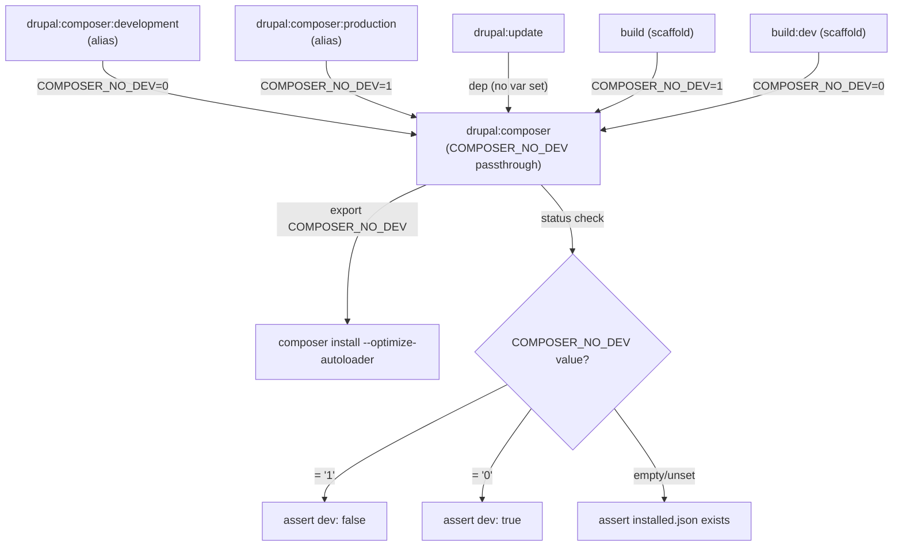

# Plan: Unified drupal:composer Task with Update Dependency

## Original Work Order

> Read @override-drupal-composer.md . I would like to use that to plan how to solve both issue #169 and #191. The changes should be made in a way that preserves backwards compatibility, while minimizing duplicate code. The end goal is a draft pull request with all tests passing. Instead of running tests locally, we will push to a draft PR and watch all of the workflows to know if our code is working or not.

## Plan Clarifications

| Question | Answer |
|----------|--------|
| When `drupal:update` depends on `drupal:composer` and the default `COMPOSER_NO_DEV` is dev mode, calling `drupal:update` after a production build would re-run composer in dev mode (the status check sees `"dev": false"`, expects `"dev": true`). This breaks production CI deployments (Pantheon/Acquia). Three options: (A) simplify status check to only verify vendor exists, (B) don't add composer dep to update upstream, (C) passthrough from environment — when `COMPOSER_NO_DEV` is not explicitly set, skip the dev/no-dev status check. | **Option C**: Use environment passthrough. When `COMPOSER_NO_DEV` is not explicitly set via task vars, the status check only verifies that vendor is installed (no dev/no-dev assertion). When explicitly set to `"0"` or `"1"`, the full dev/no-dev status check applies. |

## Executive Summary

This plan addresses two open Drainpipe issues by introducing a unified `drupal:composer` task that replaces the current split `drupal:composer:development` / `drupal:composer:production` approach. The new task uses Composer's native `COMPOSER_NO_DEV` environment variable to control dev/production behavior from a single task definition. Additionally, `drupal:update` gains a dependency on `drupal:composer` so that stale vendor directories are automatically refreshed before running Drupal update commands.

The `COMPOSER_NO_DEV` variable uses an environment passthrough model: when not explicitly set via task vars, the task inherits whatever value is in the system environment and the status check only verifies vendor is installed (no dev/no-dev assertion). When explicitly set to `"0"` or `"1"`, the full dev/no-dev status check applies. This prevents the `drupal:update` dependency from accidentally re-running composer in dev mode after a production build.

Backwards compatibility is preserved by keeping the old `composer:development` and `composer:production` tasks as thin aliases that call the new unified task with the appropriate variable.

## Context

### Current State vs Target State

| Current State | Target State | Why? |
|---|---|---|
| Two separate tasks: `drupal:composer:development` and `drupal:composer:production` with duplicated logic | Single `drupal:composer` task using `COMPOSER_NO_DEV` variable | Eliminates duplication; allows any task to depend on "composer install" generically without choosing dev vs production |
| `drupal:update` has no dependency on any composer task | `drupal:update` depends on `drupal:composer` | Prevents broken `drush` commands when vendor directory is stale after `git pull` (issue #191) |
| Projects must override both composer tasks to customize behavior | Projects override a single `drupal:composer` task | Reduces maintenance burden for downstream projects |
| Scaffold `Taskfile.yml` references `drupal:composer:production` and `drupal:composer:development` directly | Scaffold uses `drupal:composer` with `COMPOSER_NO_DEV` variable | Scaffold demonstrates the recommended pattern |
| Old task names have no forwards-compatibility path | Old task names become aliases calling the unified task | Existing projects continue working without changes |

### Background

**Issue #169** — The core insight from @deviantintegral is that having two separate composer tasks makes it impossible for other tasks to generically depend on "composer install." Every task that needs composer must pick one variant or the other, which leads to project-level overrides. The `COMPOSER_NO_DEV` environment variable is a native Composer feature that elegantly handles this.

**Issue #191** — Running `drupal:update` (which calls drush) without first running `composer install` leads to failures when the vendor directory is out of date. This commonly happens on developer machines after `git pull`. The fix is to make `drupal:update` depend on the composer task, so it automatically runs when needed.

**Concern from @justafish** — There's a concern about `drupal:update` running in remote environments where you don't want composer to run. The environment passthrough approach (Option C) addresses this: when `COMPOSER_NO_DEV` is not explicitly passed as a task variable, the status check only verifies that vendor is installed — it does not assert dev/no-dev state. This means in production CI where composer has already run (in either mode), the dep is a no-op.

**Key Taskfile behavior** — Task's `sources`, `generates`, and `status` fields provide fingerprinting. If `composer.json`/`composer.lock` haven't changed AND the `status` check passes, the task is skipped entirely. Adding `drupal:composer` as a dependency to `drupal:update` has near-zero overhead when dependencies are already installed. The `status` check's three-way conditional (see architecture below) ensures it doesn't inadvertently trigger a mode switch.

**Production CI flow** — In Pantheon/Acquia deployments, `task build` runs first with `COMPOSER_NO_DEV=1`, then `task drupal:update` runs separately. These are separate task invocations, so `run: once` does NOT prevent re-execution. The environment passthrough design ensures `drupal:update`'s composer dep doesn't undo the production install.

## Architectural Approach

### Unified `drupal:composer` Task

**Objective**: Replace duplicated composer task logic with a single parameterized task.

The new `drupal:composer` task in `tasks/drupal.yml` will:
- Accept a `COMPOSER_NO_DEV` variable with **no forced default** — it passes through from the calling context or system environment
- Run `export COMPOSER_NO_DEV={{.COMPOSER_NO_DEV}} && composer install --optimize-autoloader`
- Use `sources` / `generates` for file fingerprinting (`composer.json`, `composer.lock`)
- Use a **three-way status check**:
  - `COMPOSER_NO_DEV` = `"1"` → verify `"dev": false` in `installed.json`
  - `COMPOSER_NO_DEV` = `"0"` → verify `"dev": true` in `installed.json`
  - `COMPOSER_NO_DEV` is empty/unset → only verify `installed.json` exists (no dev/no-dev assertion)

The three-way status check is the key design decision. It means:
- **Explicit calls** (`task drupal:composer COMPOSER_NO_DEV=1`) get full dev/no-dev validation and will re-run if the mode is wrong
- **Implicit deps** (`drupal:update` depending on `composer` without setting the var) only ensure vendor is present — they won't undo a prior install in either mode

### Backwards-Compatible Aliases

**Objective**: Ensure existing projects using `drupal:composer:development` and `drupal:composer:production` continue to work.

The old task names are retained as thin wrappers:
- `composer:development` — calls `composer` with `COMPOSER_NO_DEV: "0"`
- `composer:production` — calls `composer` with `COMPOSER_NO_DEV: "1"`

These aliases use `cmds: [{task: composer, vars: {...}}]` which delegates completely to the target task including its fingerprinting. No `sources`/`generates`/`status` on the aliases — all logic lives in the unified task.

### Update Task Dependency

**Objective**: Ensure `drupal:update` automatically runs composer install when vendor is stale (issue #191).

Add `composer` as a dependency of the `update` task in `tasks/drupal.yml`. Because no `COMPOSER_NO_DEV` value is passed, the three-way status check takes the "empty" branch — it only verifies that `installed.json` exists. This means:
- On a dev machine after `git pull` with missing/stale vendor → composer runs (dev mode, matching Composer's native default)
- In production CI after `task build` with `COMPOSER_NO_DEV=1` → vendor already exists → composer is skipped entirely

### Scaffold and Test Fixture Updates

**Objective**: Update the scaffold template and test fixtures to use the new unified pattern.

- `scaffold/Taskfile.yml`:
  - `build` task: call `drupal:composer` with `COMPOSER_NO_DEV: "1"` (replaces `drupal:composer:production` dep)
  - `build:dev` task: call `drupal:composer` with `COMPOSER_NO_DEV: "0"` (replaces `drupal:composer:development` dep)
- Test fixtures:
  - `tests/fixtures.drainpipe-test-build/Taskfile.yml`: keep using `drupal:composer:production` — this validates the BC alias works
  - `tests/fixtures/drainpipe-test-github-actions/Taskfile.yml`: keep using `drupal:composer:production` — same BC validation
  - `tests/fixtures/drainpipe-task-upgrade/Taskfile.yml`: update to new pattern (this fixture mirrors the scaffold)
- CI workflow (`TestTaskfileInstaller.yml`): Update `ddev task drupal:composer:development` calls to `ddev task drupal:composer`

*Keeping some test fixtures on the old alias names provides automatic CI validation that the BC aliases work correctly.*

### CI Validation Strategy

**Objective**: Validate changes via draft PR CI workflows rather than local testing.

Push changes to the `169--composer-improvements` branch, create a draft PR referencing issues #169 and #191, and iterate based on CI workflow results. All existing workflows (TestTaskfileInstaller, test-production-build, TestFunctional, ValidateTaskfile, etc.) will exercise the changes.

## Risk Considerations and Mitigation Strategies

Technical Risks

- **Three-way status check template syntax**: The Go template conditional with three branches (eq "1", eq "0", else) in Taskfile's `status` block needs careful whitespace handling.
    - **Mitigation**: The two-way version is proven in the project-level override. Extending to three-way is straightforward — the third branch is simpler (just `test -f`).

- **Empty `COMPOSER_NO_DEV` passthrough**: When `COMPOSER_NO_DEV` is empty/unset, `export COMPOSER_NO_DEV=` effectively means dev mode for Composer (Composer treats empty as "include dev"). This is correct for the developer workstation use case.
    - **Mitigation**: This matches Composer's native behavior. No special handling needed.

- **Alias tasks may not forward `sources`/`generates`/`status` correctly**: When `composer:development` calls `composer` via `cmds`, the fingerprinting from the parent task definition matters.
    - **Mitigation**: The alias tasks use `cmds: [{task: composer, vars: {...}}]` which delegates completely to the target task including its fingerprinting. Do not duplicate `sources`/`generates`/`status` on the aliases.

Backwards Compatibility Risks

- **Projects directly depending on `drupal:composer:development` or `drupal:composer:production`**: These task names must continue to work.
    - **Mitigation**: Retain both as alias tasks that delegate to `drupal:composer`. Test fixtures specifically validate these aliases in CI.

- **Projects overriding `drupal:composer:development` or `drupal:composer:production`**: These overrides will continue to work since the task names still exist.
    - **Mitigation**: No change needed. Taskfile's override mechanism works on task names regardless of implementation.

- **Adding `composer` dependency to `drupal:update` in production CI**: In Pantheon/Acquia deployment flows, `drupal:update` is called as a separate invocation after `build`.
    - **Mitigation**: The three-way status check's "empty" branch only verifies `installed.json` exists — it does not check dev/no-dev state. Since vendor is already installed from the build step, composer is skipped entirely.

## Success Criteria

### Primary Success Criteria
1. All existing CI workflows pass on the draft PR
2. `drupal:composer` task works correctly with `COMPOSER_NO_DEV=0` (dev), `COMPOSER_NO_DEV=1` (production), and unset (passthrough)
3. `drupal:composer:development` and `drupal:composer:production` continue to work as aliases (validated by test fixtures)
4. `drupal:update` automatically runs `drupal:composer` when vendor is missing, and skips it when vendor is present (regardless of dev/prod mode)
5. No duplicate task logic — all composer install behavior flows through the single `drupal:composer` task

## Self Validation

1. Push changes and create a draft PR on the `169--composer-improvements` branch
2. Monitor the following CI workflows for green status:
   - **ValidateTaskfile** — confirms the taskfile YAML is valid
   - **test-production-build** — exercises `drupal:composer:production` alias via `build` task (BC validation)
   - **TestTaskfileInstaller** — tests task upgrade paths using composer tasks
   - **TestFunctional** — full functional test suite
   - **TestGitHubActions** — tests GitHub Actions scaffolding (uses `drupal:composer:production` alias)
3. Verify that the PR diff shows no duplicated composer install logic between the unified task and aliases

## Documentation

- Update the scaffold `Taskfile.yml` comments to reflect the new recommended approach
- The `desc` field on alias tasks should indicate they delegate to `drupal:composer`
- No separate documentation files needed — the task descriptions and issue references in the PR are sufficient

## Resource Requirements

### Development Skills
- Taskfile (go-task) YAML syntax including variables, templates, deps, sources/generates/status
- Composer environment variables and behavior
- GitHub Actions workflow understanding for CI validation

### Technical Infrastructure
- GitHub PR CI workflows (already in place)
- The `169--composer-improvements` branch (already exists)

## Integration Strategy

This change integrates directly into the existing `tasks/drupal.yml` task definitions. Downstream projects using Drainpipe will pick up the changes on their next `composer update lullabot/drainpipe`. Projects currently using `drupal:composer:development` / `drupal:composer:production` will continue to work via the alias tasks. Projects can migrate to the unified `drupal:composer` task at their convenience.

## Notes

- The `composer patches-repatch` call from the project-level override is intentionally NOT included in the upstream task — it is project-specific and should remain as a local customization
- The `run: once` setting in the scaffold Taskfile ensures that if multiple tasks depend on `drupal:composer`, it only executes once per single task invocation. However, separate `task` CLI invocations (e.g., `task build` then `task drupal:update`) are independent — the three-way status check handles this case
- Test fixtures deliberately use a mix of old alias names and new unified names to validate both BC and the new approach

### Change Log
- 2026-03-13: Initial plan created
- 2026-03-13: Refined status check to three-way conditional (Option C) to prevent `drupal:update` dep from undoing production composer installs. Updated architecture diagram, added production CI flow analysis, kept some test fixtures on old alias names for BC validation.
